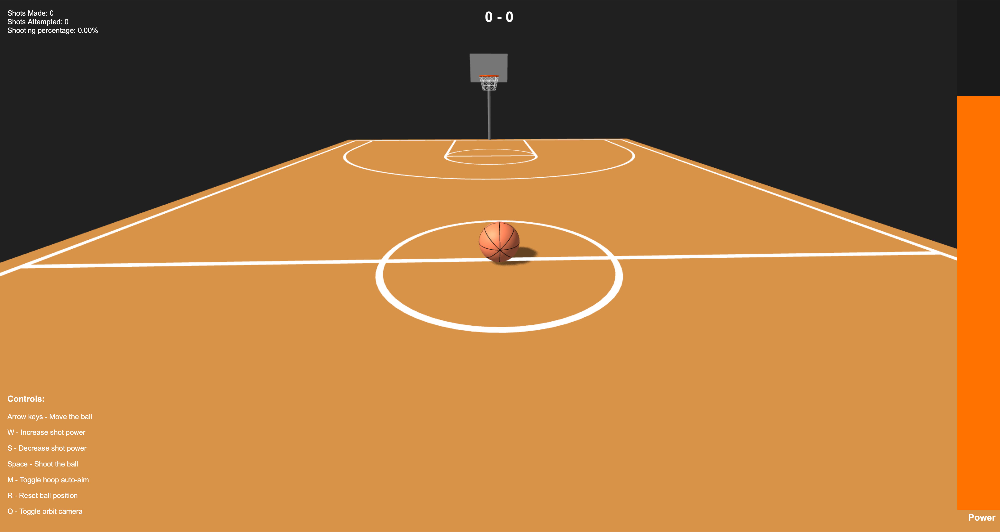

# Computer Graphics - Exercise 6 - Interactive Basketball Shooting Game with Physics

## Group Members
- Gabriel Mazor
- Shannie Chacham

## Overview
This project implements a fully interactive 3D basketball court in the browser using Three.js. Features include realistic court markings, hoops with nets, a bouncing basketball with “seams", scoring, and UI feedback.

## Running the Project
- Run the server with: `node index.js`
- Access at http://localhost:8000 in your web browser

## Controls
- `Arrow Keys` Move the ball on the court
- `W` Increase shot power (hold)
- `S` Decrease shot power (hold)
- `Space` Shoot the ball
- `M` Toggle hoop auto-aim (on by default)
- `R` Reset the ball to its starting position
- `O` Toggle Orbit‐style camera on and off

## Description of Physics System
| Aspect | Implementation |
|--------|------------------------|
| **Gravity** | Constant downward acceleration $g = -9.81 m/s^2$ applied to `ballVelocity.y` every frame. |
| **Ground** | Plane at *y = 0.4 m* (ball radius). If the center drops below, y position is set to 0.4m.
| **Rolling Friction** | While the ball is on the floor, horizontal velocity is multiplied by 0.99 each frame so it comes to rest after several bounces. |
| **Court Boundaries** | Crossing court boundries clamps position and reflects the corresponding velocity.
| **Collisions** | Collisions with rim, backboard and poler reflect velocity about outward normal.
| **Energy Loss** | All reflections multiply the normal component by `(1 + RESTITUTION)` giving damped rebounds. |
| **Shot Launch** | Player sets `shotPower`. Horizontal dir = ball - nearest hoop. Vertical component `Vy = k·shotPower`, where `k (0.6 – 1.5)` depends on distance, makes higher arcs for close shots. |
| **Rotation** | Angle of rotation $\Delta \theta = \frac{s}{radius}$, on axis = **(horizontal velocity × up)**, applied on `rotateOnWorldAxis` so seams stay locked to words coordinate system. |
| **Score Detection** | Ball center must pass downward through *y = 3.0 m* while inside a 0.45 m cylinder; each make adds **+2** and re-arms when the ball rises 0.2 m above rim and `shotInProgress = true`|

## Additional Features
| Feature | Description |
|---------|---------|
| **POV Aim** | Aiming the shot using the camera direction, can be toggled on/off using the `M` key. |
| **Auto Aim** | Aiming to the nearest hoop, on by default. If the ball is exactly in the middle, the target hoop is randomly selected. |
| **Power Meter** | A vertical bar that fills and shifts color to indicate shot strength. |
| **Comprehensive Scoring System** | Real-time shots-attempted, shots-made, and shooting-percentage displayed top-left. |
| **Audio Effects** | Plays a swish sound whenever a shot is made. |
| **Shadow Optimisation** | Enlarged directional-light shadow map so shadows casted everywhere. |
| **Controls Panel** | On-screen control legend. |

## Sources of External Assets
| Asset                       | Source |
|-----------------------------|------------------|
| `swoosh.wav` | [Pixabay](https://pixabay.com/) |

## Screenshots
**Initial View**

**Ball Closeup**

**Hoop Closeup**

**Score**

**Basketball Being Moved Around the Court**

**Shot power adjustment**

**Basketball shooting mechanism**

**Successful shot with score update**

**Complete UI showing scores, statistics and controls**

**Ball rotation animation during movement**
 
**Ball rotation animation during flight**
 
**Short video demonstrating gameplay**
 